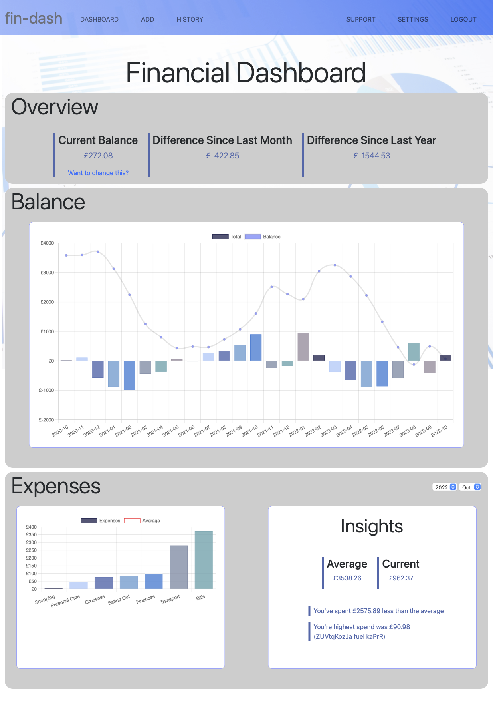
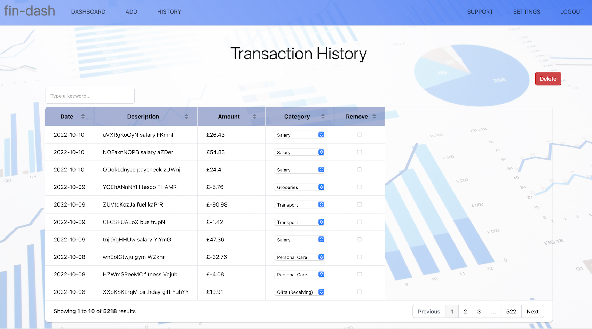

# CS50x Final Project - Financial Dashboard
#### Video Demo:  <URL HERE>
#### Description:

> fin-dash is a financial dashboard web-application that allows users to categorise and track their expenses. Users are able to create an account within the application giving them returnable access.

>The application uses Python and sqlite for the backend, and Javascript for the frontend. The framework used is Flask.

---
## Sections
- [Registering](#registering)
- [Returning Users](#returning-users)
- [Categorization](#categorization)
- [Main Dashboard](#main-dashboard)
    - [Overview](#overview)
    - [Balance Chart](#balance-chart)
    - [Expenses Chart](#expenses-chart)
    - [Insights](#insights)
- [Adding transactions](#adding-transactions)
    - [Manual](#manual)
    - [Uploading](#uploading)
- [History](#history)
    - [Deleting transactions](#deleting-transactions)
    - [Updating transaction categories](#updating-transaction-categories)
- [Support](#support)
- [Settings](#settings)
    - [Changing password](#changing-password)
    - [Updating current balance](#updating-current-balance)
- [Additional Information](#additional-information)

---
## Registering

From the welcome page new users will be able to register for an account using either the "Sign Up Now!" button, or the "Register" link in the navigation bar.

From here users will be greeted with a form to enter their personal details including;

- First name
- Last name
- Email address (which will be used as the 'username')
- Password (must be at least 8 characters)

After completing and submitting the form, users will be redirected to the main dashboard page.

>#### Technical note: User passwords are hashed before they are added to the database using werkzeug.security.

---
## Returning Users

Returning users to the site will be able to log back into their accounts from the 'Login' page. This can be accessed through the navigation bar at the top of the window.

---
## Categorization

Aim is to split up spends into different categories, can be income/expense
list the categories

---
## Main Dashboard

>The main dashboard consists of 'cards'. Each card relates to a different visual display of the users current financials.

### Overview

The overiew section is located at the top of the main dashboard. Inside of this block is a look at the users current balance.
Alongside this is also a link for the user to update their current balance if they require (see [here](#updating-current-balance) for more details).

**IMAGE**

### Balance Chart

The balance chart has two elements - a balance line chart and a monthly total bar chart.  The aim is to give a visual representation of how the users balance has changed over time, and highlights the months where the user was in positive or negative equity.

The chart timeline spans from the start of the users transactions to now. 

Each element on the chart can be activated/deactivated by the user by clicking on the legend objects.

### Expenses Chart

Defaults to the current month, shows the amount of expenses per category a user has spent in that month. Averages hidden by default.

### Insights

The insights give a glimpse of how the current month compares to the average over the last year.

---
## Adding transactions

>Users can add transactions to their account via two methods: adding the information manually for individual transactions, or by uploading all of their transactions using a CSV file. Both of these options can be found on the 'Add' page through the navigation bar.

### Manual

To add a transaction manually, the user must populate the 'Add' form. It is important to ensure the amount given is signed as once the form is submitted, the amount will be added/deducted from the users current balance.

### Uploading

If the user has a large amount of transactions to add, the easiest method is to upload a CSV file.

The CSV file must match the following table structure;

| Date       | Amount | Description  |
| ---------- | ------ | ------------ |
| 2022/08/25 | -100   | Shopping     |

Handles dates
Uses the description to categorise transactions into categories (see below)
Doesnt handle non-csv
Doesnt handle incorrect column structures
Information can be found on settings page (see here)

---
## History

### Deleting transactions

### Updating transaction categories
---
## Support

The support page gives users more information on how to correctly format a .csv file for uploading. There is a sample dataset and highlights the key columns (and descriptions) that are required for the upload to be accepted.

---
## Settings

>The settings page is where the user can make changes to their account details and update their balance if the require.

### Changing password

From the setting page, there is a form for the user to update their password. They will require their existing password to do so, and the new password must be at least 8 characters long.

### Updating current balance

---
## Additional Information

random data creation