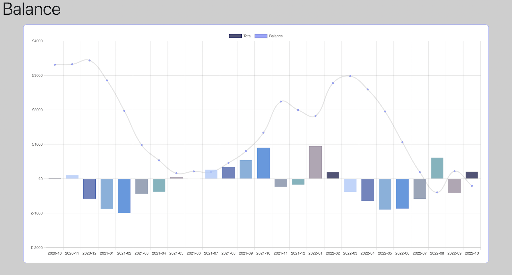
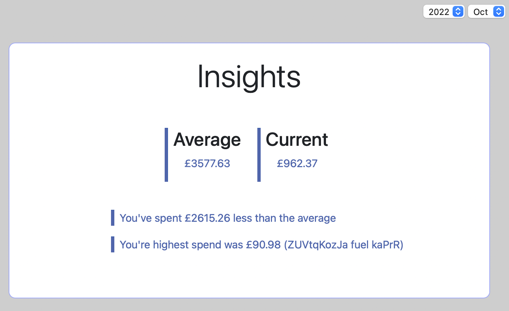

# CS50x Final Project - Financial Dashboard
#### Video Demo:  https://youtu.be/nqQpAd07gBY
#### Description:

*fin-dash* is a financial dashboard web-application that allows users to categorise and track their expenses. Users are able to create an account within the application giving them returnable access.

>The application uses Python and sqlite for the backend, and Javascript for the frontend. The framework used is Flask.

---
## Sections
- [Registering](#registering)
- [Returning Users](#returning-users)
- [Categorization](#categorization)
- [Main Dashboard](#main-dashboard)
    - [Overview](#overview)
    - [Balance Chart](#balance-chart)
    - [Expenses Chart](#expenses-chart)
    - [Insights](#insights)
- [Adding transactions](#adding-transactions)
    - [Manual](#manual)
    - [Uploading](#uploading)
- [History](#history)
    - [Deleting transactions](#deleting-transactions)
    - [Updating transaction categories](#updating-transaction-categories)
- [Support](#support)
- [Settings](#settings)
    - [Changing password](#changing-password)
    - [Updating current balance](#updating-current-balance)
- [Additional Information](#additional-information)
- [Dashboard Example](#dashboard-example)

---
## Registering

From the welcome page, new users will be able to register for an account using either the "Sign Up Now!" button, or the "Register" link in the navigation bar.

From here users will be greeted with a form to enter their personal details, including:

- First name
- Last name
- Email address (which will be used as the 'username')
- Password (must be at least 8 characters)

After completing and submitting the form, users will be redirected to the main dashboard page.

>Technical note: User passwords are hashed before they are added to the database using werkzeug.security.

 ##### <a href="#sections" style="color:steelBlue">Back to top</a>

---
## Returning Users

Returning users to the site will be able to log back into their accounts from the 'Login' page. This can be accessed through the navigation bar at the top of the window.

---
## Categorization

One of the aims of the dashboard is to organise transactions into a range of categories so that the user can see how their outgoings are split.

The categories used in this program are:

| Category          | Type    |
| ----------------  | ------- |
| Bills             | Expense |
| Eating Out        | Expense |
| Entertainment     | Expense |
| Family            | Expense |
| Finances          | Expense |
| Gifts (Giving)    | Expense |
| Gifts (Receiving) | Income  |
| Groceries         | Expense |
| Holidays          | Expense |
| Salary            | Income  |
| Personal Care     | Expense |
| Savings           | Expense |
| Shopping          | Expense |
| Transfers         | Expense |
| Transport         | Expense |
| General (Income)  | Income  |
| General (Expense) | Expense |

Transactions are categorized either through manually selecting a category when [adding a single transaction](#manual), or automatically when [uploading a CSV](#uploading).

##### <a href="#sections" style="color:steelBlue">Back to top</a>

---
## Main Dashboard

>The main dashboard consists of 'cards'. Each card relates to a different visual display of the users current financials.

### Overview

The overiew section is located at the top of the main dashboard. Within this card is a look at the users current balance, and how it has changed over the last month, and last year.
Alongside this is also a link for the user to [update their current balance](#updating-current-balance) if they require.

### Balance Chart

The balance chart has two elements - a balance line chart and a monthly total bar chart.  This gives a visual representation of how the users balance has changed over time, and highlights the months where the user was in positive or negative equity.

The chart timeline spans from the start of the users transactions to the current month. 

Each element on the chart can be activated/deactivated by the user by clicking on the legend objects. By default, all chart elements are activated.

### Expenses Chart

The expenses chart shows the users spending totals per category for a given month. When the page is loaded, the current months data is displayed. This can be changed using the date selection boxes located on the right of the card. The chart also features an 'averages' overlay which shows the average total spending per category over the last year. By default, this overlay is deactivated, creating a cleaner and more visual chart. Users can activate the 'averages' data by clicking on the legend object.

Each element on the chart can be activated/deactivated by the user by clicking on the legend objects. By default, all chart elements are activated.

### Insights

The insights give a glimpse of how the current (or selected) month compares to the average over the last year.
The card contains the average total spending per month over the last year, along with the current monthly total.
There is also information on the difference between the average and current, and the highest single expense that month.

##### <a href="#sections" style="color:steelBlue">Back to top</a>

---
## Adding transactions

>Users can add transactions to their account via two methods: adding the information manually for individual transactions, or by uploading all of their transactions using a CSV file. Both of these options can be found on the 'Add' page through the navigation bar.

### Manual

To add a transaction manually, the user must populate the 'Add' form. It is important to ensure the amount given is signed (+/-), as once the form is submitted, the amount will be added/deducted from the users current balance.

### Uploading

If the user has a large amount of transactions to add, the easiest method is to upload a CSV file.

The CSV file must match the following table structure:

| Date       | Amount | Description   |
| ---------- | ------ | ------------- |
| 2022/08/25 | -100   | Food Shopping |

The upload function will allow for a variety of date formats, and return errors to the user if the column format or file format are incorrect.

During the upload, the text within the 'description' field will be checked against a pre-defined assignment table within the database and a category will be determined. This list can be expanded over time to enhance the automatic categorization function. If no match is found, a category of either 'General (Expense)' or 'General (Income)' will be assigned, depending on the sign of the amount.

>For example;
> - If the text contains the word 'amazon' then a category of 'shopping' will be assigned to the transaction.
> - If another description contains the word 'gym' then a category of 'Personal Care' will be assigned.

Information can be found on the [settings](#settings) page.

##### <a href="#sections" style="color:steelBlue">Back to top</a>

---
## History

>The history page shows the entirity of the users logged transactions, along with their assigned categories. The data is displayed in a table of 10 items per page. There is also a search field for retrieving specific information.

### Deleting transactions

If the user wishes to delete a single (or multiple) transactions this can be achieved by selecting the checkbox(s) in the 'Remove' column, then clicking the 'Delete' button in the top right.

### Updating transaction categories

From this page a user has the ability to change the category of any transaction. This is done simply by using the dropdown selection box under the 'Category' column. Once a new category is selected, simply clicking off that cell will update the entry in the database.

##### <a href="#sections" style="color:steelBlue">Back to top</a>

---
## Support

The support page gives users more information on how to correctly format the CSV file for uploading. There is a sample dataset and highlights the key columns (and descriptions) that are required for the upload to be accepted.

##### <a href="#sections" style="color:steelBlue">Back to top</a>

---
## Settings

>The settings page is where the user can make changes to their account details and update their balance if the require.

### Changing password

From the settings page, there is a form for the user to update their password. They will require their existing password to do so, and the new password must be at least 8 characters long.

### Updating current balance

When first registering for the dashboard, the users current balance will be initialized at zero. This current balance is used in calculating the data for the ['Balance Chart'](#balance-chart). The program will use the users current balance, and calculate the balance per month for all of the historical transactional months. Therefore having an accurate 'current balance' is crucial for obtaining accurate data. The user has the ability to update this balance by using the form on the Settings page.

>Note: When a transaction is entered manually from the 'Add' page, the current balance will be updated automatically.

##### <a href="#sections" style="color:steelBlue">Back to top</a>

---
## Additional Information

Alongside the main program there is another python program which can be used to generate random data in a CSV format for testing/illustration. This program can be found as 'random_data.py'. When running the program a desired number of data entries must be entered as a command line argument. (Usage: `python3 random_data.py ###`)
Two pre-generated data files can be found in the `/static/random_data/` directory.

##### <a href="#sections" style="color:steelBlue">Back to top</a>

---
## Dashboard Example

##### <a href="#sections" style="color:steelBlue">Back to top</a>